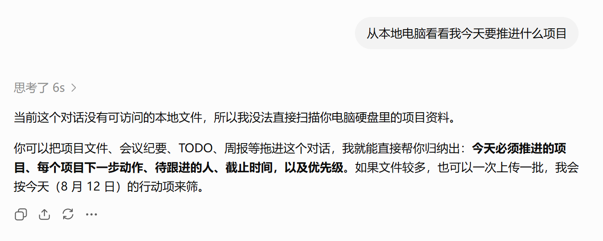
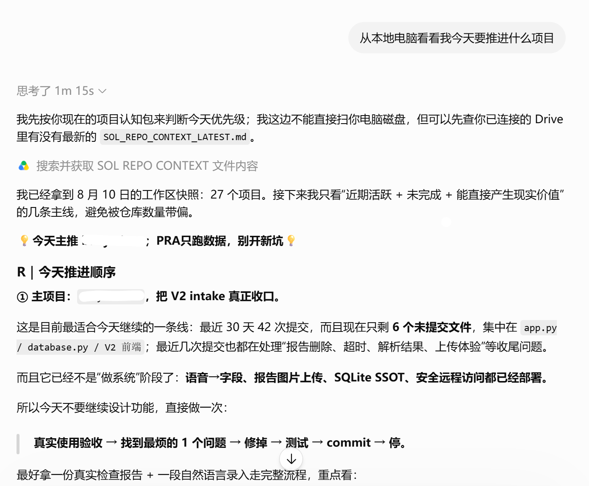

# AI Context Linker

**让 ChatGPT 持续看懂你的本地项目，无需上传源码。**

> Link your local projects to AI without sharing the codebase.

ChatGPT 很适合聊项目方向，但它默认不知道你的本地项目正在发生什么。把整个仓库上传到云端又过重，也可能泄露源码、密钥和私人运行数据。

AI Context Linker 在本地把人工批准的项目事实、关系、风险和待讨论问题编译成一个小型认知包。你只把这个认知包放进专用 Google Drive 目录，ChatGPT 通过 Drive 连接器读取的是项目地图，不是本地磁盘或整个仓库。

## 30 秒看懂

```text
本地多个项目
      ↓
明确批准的事实 manifest
      ↓  AI Context Linker 本地编译与安全检查
一份 Markdown 简报 + 一份派生关系图
      ↓  只同步专用 Context 目录
Google Drive
      ↓
ChatGPT Chat 中的项目优先级、方向与头脑风暴
```

AI Context Linker 的核心不是让 ChatGPT“读电脑”，而是为它建立一个**最小、可审阅、可重建的项目认知面**。

## 真实 Before / After

下面两张图使用了完全相同的问题：

> 从本地电脑看看我今天要推进什么项目

### Before — 没有可用的项目认知包

ChatGPT 能正确承认自己无法读取本地磁盘，但也因此不知道今天应该推进哪个项目。

<p align="center">
  
</p>

### After — 通过 Drive 读取本地同步的 Context

当专用 Context 目录同步到 Google Drive 后，ChatGPT 会先获取最新项目快照，再根据已确认事实给出具体的当日优先级和下一步。

<p align="center">
  
</p>

> 截图中的 `SOL_REPO_CONTEXT_LATEST.md` 来自作者的早期本地原型。这个真实 dogfooding 工作流验证了需求；AI Context Linker 正在将其中可复用、可审计的部分做成独立开源工具。ChatGPT 没有直接访问截图中的仓库或源码。

## 它解决什么

- 想聊项目方向、优先级和产品判断时，不必启动一次完整的代码代理任务。
- ChatGPT 能先理解你正在做什么、项目之间怎样关联、哪些事实已经确认。
- 云端只出现经过允许的最小信息，默认不出现源码、密钥、本机路径和私人运行数据。
- 图谱帮助模型看到依赖、归属和约束，但它始终可从事实重建，不充当事实真源。

## V0.1 已有能力

- 从严格白名单 JSON manifest 生成稳定的 `ai_context_linker.md`。
- 同时生成派生关系图 `ai_context_linker.graph.json`。
- 拒绝未知字段、疑似密钥、本机绝对路径和悬空关系。
- 不扫描仓库、不联网、不上传、不自动读取私人数据。

## 快速体验

```powershell
git clone https://github.com/xhonye/AI-Context-Linker.git
Set-Location AI-Context-Linker
python -m pip install -e .
python -m ai_context_linker build `
  --manifest examples/synthetic-manifest.json `
  --output-dir output
```

然后将 `output/ai_context_linker.md` 放到一个只用于 AI Context Linker 的 Google Drive 目录。不要把源码目录、工作区根目录或私人数据目录加入同步范围。

## 后续方向

### V0.2 — 从手写清单到可审计的本地采集

- 引入明确 allowlist 的确定性仓库适配器；
- 为每条事实保留来源、观察时间和过期状态；
- 发布前展示新增、删除和敏感项变化，由人确认。

### V0.3 — 可追溯变化与项目图谱

- 表达 decision、capability、document 和 open question；
- 记录项目之间的支持、依赖、替代和阻塞关系；
- 生成变化摘要、冲突检测和过期提醒。

### V0.4 — 问题定向 Context 与质量评测

- 围绕“今天推进什么”“哪些项目重复”等问题生成更小的认知切片；
- 比较无上下文 Chat、AI Context Linker 和代码代理工作流的答案质量；
- 衡量事实覆盖率、过期率、泄露拦截率和幻觉率。

### V1 — 可控刷新与开放生态

- 本地定时构建，只在事实变化时更新稳定文件；
- 高风险变化继续要求人工确认；
- 支持不同项目类型的社区适配器和多种云端文件通道。

## 为什么这个开源项目需要 AI 辅助

AI Context Linker 的运行时核心刻意保持确定性，但它的开源维护有大量适合 AI 辅助的工作：

- 用 Codex 开发和审查跨平台仓库适配器、隐私过滤器与泄露回归测试；
- 对社区提交的适配器做 PR review、权限面检查和恶意输入分析；
- 使用 API 构建可选、明确标记为推断的语义层，并对不同 Context 策略做可重复评测；
- 自动辅助 issue triage、文档更新、发布检查和多语言示例维护。

目标是在不扩大默认云端数据面的前提下，让个人开发者也能持续维护一套可审计、可测试、可扩展的 Context 基础设施。

## 产品边界

AI Context Linker 面向项目发展讨论，不替代 Codex 的代码读取、执行、测试和修改能力。“达到或优于 Work 的头脑风暴体验”是待验证目标，依赖 Context 质量，不是当前已证明的事实。

更完整的边界见 [`PROJECT_CHARTER.md`](PROJECT_CHARTER.md) 和 [`docs/security-boundary.md`](docs/security-boundary.md)。

## Open source

AI Context Linker is licensed under MIT. The standalone CLI and JSON Schema are the product core; `skills/ai-context-linker/` is an optional thin interface for compatible agents. See [`CONTRIBUTING.md`](CONTRIBUTING.md), [`SECURITY.md`](SECURITY.md), and [`docs/oss-readiness.md`](docs/oss-readiness.md) before contributing.
