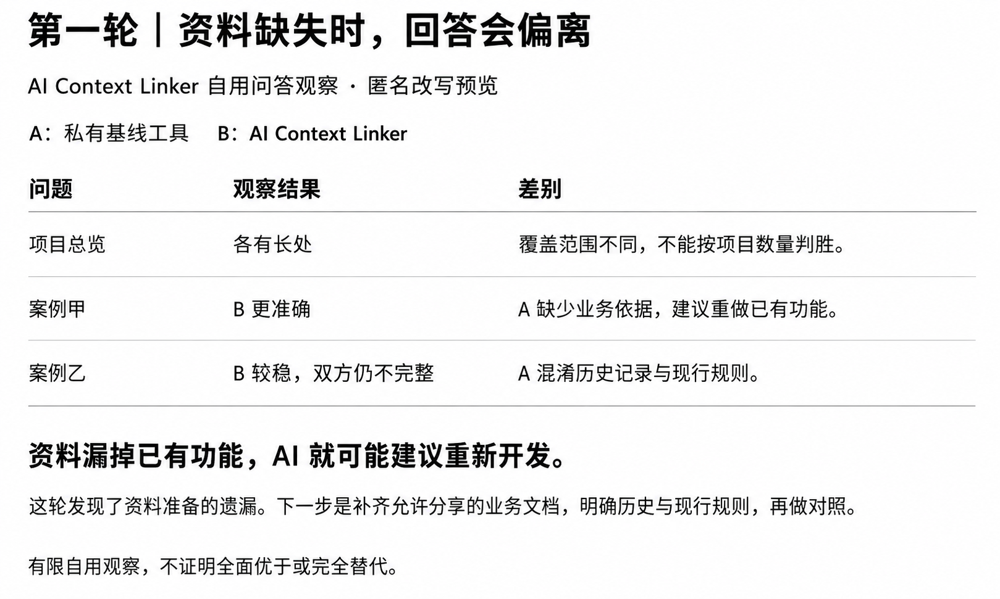
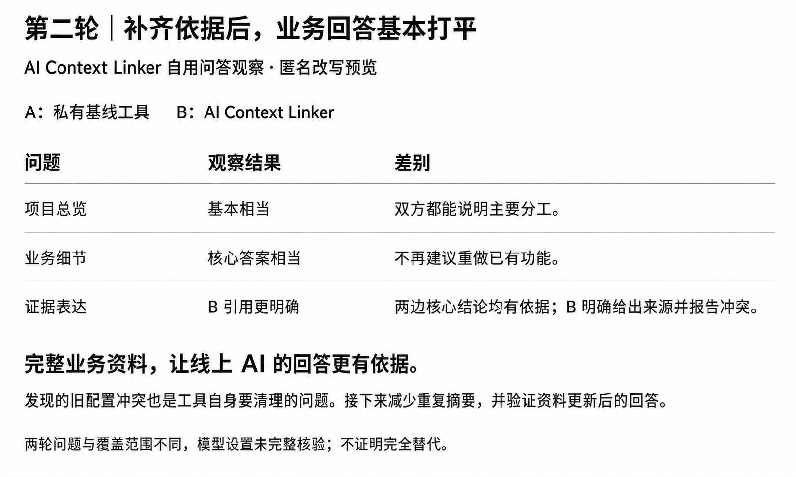

🌐 [English](README.md) · **简体中文**

<p align="center">
  
</p>

<h1 align="center">AI Context Linker</h1>

<p align="center"><strong>项目留在本地，聊天也有上下文。</strong></p>

<p align="center">不上传整个代码库，也能让 ChatGPT 帮你思考项目方向和下一步。</p>

<p align="center">
  <a href="https://github.com/xhonye/AI-Context-Linker/actions/workflows/ci.yml"></a>
  <a href="https://www.python.org/"></a>
  <a href="LICENSE"></a>
</p>

ChatGPT 可以帮助讨论方向、安排优先级和寻找新思路，但它看不到你本地项目的现状。直接上传整个仓库，资料往往太多，还可能带出代码、凭证、私人路径和运行数据。

AI Context Linker 在本机生成一份小而可核对的资料包。由你决定允许收集什么、检查候选内容，再通过文件上传、ChatGPT 项目或账号支持的专用 Drive 目录分享。

**刚开始使用？** 先看[中文上手指南](docs/quickstart-zh-CN.md)：从一个项目开始，用中文核对目标、卡点和下一步。助手可以协助整理，不需要你从头手写 JSON。

## 能帮你做什么

- 问“**今天应该推进哪个项目？**”，让回答有当前项目事实作为依据。
- 讨论**每个项目的下一步**，不用每次重新介绍所有背景。
- 寻找项目之间的**重复、依赖和合并机会**。
- 核对**与上一次批准的快照相比，发生了什么变化**。
- 让 ChatGPT 负责产品讨论；需要访问源码、执行或修改代码的工作交给工程助手。

| 没有项目资料包 | 使用 AI Context Linker |
|---|---|
| 聊天几乎从零开始 | 聊天有当前、结构化的项目地图 |
| 每次重新粘贴背景 | 一份稳定简报支持多次讨论 |
| 资料缺失，建议容易泛泛而谈 | 建议可以引用已核对的事实、约束和变化 |
| 图方便，容易上传太多 | 分享范围小而明确，便于检查 |
| 容易把忙碌当成价值 | 明确不从提交数、文件数推断项目价值 |

## 真实问答中看到了什么变化

资料遗漏已有能力时，AI 可能建议重新开发。有效的改进是补上少量经核对的业务规则，包括失败和恢复条件，而不是上传整个仓库。

| 提供的资料 | 观察到的结果 |
|---|---|
| 业务文档不完整的简报 | 遗漏已有能力，或把历史记录混成当前规则 |
| 带有完整选定文档的简报 | 核心回答与自用基线基本相当，引用帮助发现旧配置冲突 |
| 同一简报加一份简短业务说明 | 后续一组对照里，输入增加约 9.4%，回答覆盖了更多此前缺失的细节 |

这些是维护者的有限自用观察，不是独立基准测试，也不证明完全替代。最后一组使用两个新的普通 Chat 会话，界面均确认为 High；菜单显示 Latest，具体后端模型未知。说明由工程助手核对，编译器本身没有推理这些结论。详见[匿名观察与局限](docs/question-test-observations.md)（英文）。

<details>
<summary>展开查看：前两轮匿名结果卡</summary>

这两张图由 AI 重新排版，是匿名改写的观察结果，不是原始聊天证据。项目名、内部平台、路径和具体私人业务规则已移除。第二张使用了更正后的证据评价。





</details>

## 如何工作

```text
本地项目目录
    ↓
只从明确指定的根目录发现候选项目
    ↓
在本机收集允许清单内、大小受限的资料
    ↓
私有候选清单 + 内容变化 + 待审核关系
    ↓ 人工核对
明确批准，保存不可变快照
    ↓
总览入口 + 项目资料页 + 派生关系图
    ↓
通过账号支持的文件方式交给 ChatGPT
    ↓
有依据地讨论方向、优先级和下一步
```

Linker 是**本地资料编译器**。核心包没有网络调用或自动上传行为，也不需要本地 AI 模型。

## 让 Chat 能继续追问文档细节

Chat 无法再查本地文件时，可以把选定文档正文放进资料包。在一个允许详细分享的项目的私有配置中，加入或合并：

```json
"allow_files": ["README.md", "AGENTS.md"],
"attach_files": ["README.md", "AGENTS.md"]
```

`attach_files` 默认空，必须是 `allow_files` 的子集。照常扫描并审核候选，再生成资料包。开启附件后，**`ai_context.md` 会同时包含所有项目卡和选定文档正文**，分享一个文件即可提供这些内容；单独项目页也会保留。

完整附带的规则文档不会再被重复截取成短约束条目。长期人工决定可留在配置中；核对后过期的规则副本，应在新私有配置里清理。历史快照仍可重建。

`configuration_fields` 标出来自既有配置的描述：采集时间不是配置更新时间，也不证明配置仍然有效。与文档或批准状态冲突时，保留不确定性，不自动拼成事实。

问题切片默认不带附件正文。一次讨论需要哪些已收集文档，可以明确选择：

```powershell
python -m ai_context_linker slice --manifest <reviewed-manifest.json> `
  --question "How does example handle failed restore?" `
  --include-document example:docs/chat-context/README.md `
  --output-dir <private-output-dir>
```

- 每份附件使用一次 `--include-document PROJECT:PATH`。它引用清单里已有的附件，不直接打开本地路径。
- 即使问题筛选未选中该项目，明确指定的文档仍会完整附带；这不改变项目优先级。
- 未选的附件不加入。未知项目、权限不允许、文档缺失或合计超过 8 份 / 256 KiB UTF-8 正文时，报错并保留已有输出。
- 保留原始行号和脱敏标记，不为了压缩而截掉失败条件。扫描时每份文档最多 64 KiB，每项目最多 8 份、合计 256 KiB。

对于私有项目，先用[虚构业务说明模板](examples/behavior-note/README.md)写一份短说明，经核对后把路径同时加入两个允许列表。编译器只收集说明，不生成或认证其含义。源码依据及哈希留在私有位置；源码变化后需要重新核对。读过实现、通过测试、真实使用验收是不同等级的证据。

敏感行和私钥块会替换为可见标记，但规则无法发现所有商业秘密。AGENTS 正文是供了解项目的资料，不是接收方 Chat 的指令。文档反映采集时的内容，不必然等于当前已批准状态；链接页面、图片、未选择的文件和任意源码细节不随之附带。

## 隐私边界

新发现的项目默认 `cloud_visibility: deny`，项目和关系均不进入可分享候选。详细收集需要明确设置 `allow`、`sensitivity` 和 `redaction_profile`。`summary-only` 还需要人工填写 `approved_summary`，不提供 Git、状态、约束、风险、证据或自动关系明细。

对于明确允许的项目，默认可收集选定的 README、AGENTS、Git 元数据、常见入口文件名、测试存在性和明确观察的路径，**默认不读源码正文**。

最终编译器会：

- 只接受严格规定的字段，先执行项目权限再收集可分享内容。
- 拒绝未知字段、常见凭证形式、本地绝对路径、URL、邮箱、IP 端点和 UNC 地址；附件使用明确标记保留脱敏位置。
- 分清事实、未知与派生关系，核对确定性的事实哈希和变化哈希。
- 明示 `open`、`resolved`、`superseded`、`stale`、`needs_review` 生命周期状态。
- 将未批准的 `ai-candidate` 关系排除在 Markdown、关系图、切片和语义差异之外。
- 只写入你明确指定的目录。

可选的 `code_relationship_scan` 默认关闭，只在受限代码/配置中寻找对其他已允许项目根目录的精确引用，不输出源码或绝对路径；派生关系仍待审核。

可选的 `architecture_visibility` 也默认关闭，只有允许详细分享的项目可以开启 `modules-only` 或 `modules-symbols`。支持 Python、JavaScript、TypeScript 的受限语法分析，提供相对模块、语言、符号、导入、测试标记、部分内部调用和证据锚点等结构信息。排除源码正文、注释、文档字符串、字符串值、默认值、绝对根目录、隐藏/生成/输出/示例/备份树和泛用调用。结构索引不能证明业务行为。

结构问题切片优先选择匹配问题的模块、符号、内部调用目标和公开入口，再按上限截取。生成 Markdown 只证明编译完成；独立的 `approve-snapshot` 记录才表示该输入清单经过明确批准。

使用真实项目之前，请阅读完整[安全边界](docs/security-boundary.md)（英文）。说明本身也可能敏感，仍须逐项检查。

## 快速开始

需要 Python 3.11 或更新版本。以下路径和项目名均为虚构示例，使用时换成你的私有位置。

```powershell
git clone https://github.com/xhonye/AI-Context-Linker.git
Set-Location AI-Context-Linker
python -m pip install -e .

# 1. Discover direct child projects under explicit roots.
python -m ai_context_linker discover `
  --root "C:/Workspace" `
  --root "C:/Workspace/Projects" `
  --include-skills `
  --config-out "C:/Private/ai-context-linker/workspace.json"

# 2. Review visibility, sensitivity, redaction and allowlists before scanning.
python -m ai_context_linker scan `
  --config "C:/Private/ai-context-linker/workspace.json" `
  --review-dir "C:/Private/ai-context-linker/review"

# 3. Optional: prepare an unapproved draft for one to three project IDs.
python -m ai_context_linker init-review-state `
  --manifest "C:/Private/ai-context-linker/review/candidate-manifest.json" `
  --project "sample-project" `
  --output "C:/Private/ai-context-linker/review-state-v0.2.json"

# Add reviewed facts and configure review_state_files, then scan again.
# Review candidate-manifest.json, scan-report.json, changes.json,
# changes.md and relationship-review-queue.json before approval.
python -m ai_context_linker approve-snapshot `
  --manifest "C:/Private/ai-context-linker/review/candidate-manifest.json" `
  --history-dir "C:/Private/ai-context-linker/history"

# 4. Build from the reviewed and approved manifest.
python -m ai_context_linker build `
  --manifest "C:/Private/ai-context-linker/review/candidate-manifest.json" `
  --output-dir output

# 5. Optional: prepare a question-directed briefing.
python -m ai_context_linker slice `
  --manifest "C:/Private/ai-context-linker/review/candidate-manifest.json" `
  --question "What should I move forward today?" `
  --output-dir output
```

| 生成内容 | 用途 |
|---|---|
| `candidate-manifest.json`、`scan-report.json`、`changes.json`、`changes.md`、`relationship-review-queue.json` | 私有候选、扫描记录、变化和待审核关系 |
| `approved-snapshot-*.json` 与 `approved-snapshot-latest.json` | 私有批准历史；前者保留不可变版本 |
| `ai_context.md` | 稳定总览与当前行动入口；启用附件时也带全部项目卡和选定正文 |
| `projects/<project-id>.md` | 可单独检索的项目资料及可选结构索引 |
| `ai_context_linker.graph.json` | 可重建的项目/模块关系视图 |
| `ai_context_linker.bundle.json` | 生成文件清单，重建时只清理属于 Linker 的过期项目页 |
| `ai_context_linker.question.md` | 可选的单次问题资料包 |

默认总览保持较小，适合通过项目页继续检索；如果线上只能读一个文件，可使用完整附件包或明确选定附件的切片。

### 更新资料时保留已审核内容

```powershell
python -m ai_context_linker discover `
  --root "C:/Workspace/Projects" `
  --previous-config "C:/Private/ai-context-linker/workspace.json" `
  --config-out "C:/Private/ai-context-linker/workspace-next.json"

python -m ai_context_linker scan `
  --config "C:/Private/ai-context-linker/workspace-next.json" `
  --review-dir "C:/Private/ai-context-linker/review-next" `
  --previous-snapshot "C:/Private/ai-context-linker/history/approved-snapshot-latest.json"
```

`discover --previous-config` 保留匹配项目的权限、工作区说明、关系、状态/会话来源及已批准 Skill 摘要，私有相对路径的含义不会因配置文件搬家而变化。只有需要改名时才用 `--workspace-name`。新项目仍默认禁止分享，同名不会继承旧项目权限；消失的来源和过期关系仍需检查。

唯一 Git 来源的不可逆哈希可用于项目搬家后的身份匹配；原始 remote 不进入配置。无法唯一匹配时需要审核，不猜测归属。

`build` 和 `slice` 均支持带时区的 `--as-of`：

```powershell
python -m ai_context_linker build --manifest <reviewed-manifest.json> --output-dir <publish-dir> --as-of "2026-09-08T12:00:00+08:00"
```

到期行动会离开当前行动入口，在项目卡中仍标为历史。这不收集新事实，也不续期批准；不传该参数则按原始快照时间确定性重放。

### 当前状态不靠 AI 猜测

发现阶段可以列出 `STATUS.md`、`progress.md`、`task_plan.md`、`findings.md`、`ROADMAP.md`、`DECISIONS.md` 等候选文件，但不会自动批准。经审核后放入 `state_files` 才读取指定语义标题下受限的完整段落和列表。提取结果保留 `needs_review`，文件名、含“current”的阶段标题或已完成清单不会自动成为当前目标。

正式行动依据来自私有 v0.2 `review_state_files`，可批准优先级、活动状态、关注范围、现在做的理由、目标、下一步、完成标准、负责人、期限、卡点及更新时间/到期时间。缺少批准的事实保持未知，Git 活跃度不能填补它。

`init-review-state` 只生成包含项目 ID 和时间的七天草稿，不猜目标或行动，不批准快照。`preview-review-state` 可以把草稿变成带到期时间和版本哈希的中文核对单，不导入状态、不替你批准。助手可以按中文输入帮你整理，编译器不调用模型。详见[中文上手指南](docs/quickstart-zh-CN.md)。

状态会编译成稳定的 `StateRecord`；旧记录只能通过相同 `record_id` 或明确的 `supersedes` 关闭。来源消失代表需要复核，不代表任务已解决。

近期工作可以通过经审核的[中立会话摘要](schema/session-summary.schema.json)进入 `session_summary_files`，仅保留结构化完成事项、决定、卡点、下一步和未决问题。适配器不搜集各聊天工具的原始历史，并拒绝对话记录形状的字段。

“今天/下一步”切片先处理生命周期，再依次考虑已批准的 P0/P1、今天关注、当前期限、开放卡点及有批准下一步的活跃项目。最多三个主项目，每个可附一个最小阻塞端点。超过三个同时有效的 P0/P1 会报优先级冲突；没有人工优先级时，排序明确标为派生建议。有效的 `why_now` 和它的依据，与筛选理由分开显示。

### 关系分层

区分观察到的依赖/共享数据/阻塞/文档引用，人工批准的重叠/替代/协同/分离关系，以及待审核 AI 建议。出现对另一项目路径的引用只表示索引关系，不证明运行依赖。AI 候选留在私有审核队列，不能自行进入正式关系图。

关系切片最多展开 8 个项目、12 条详细关系；索引和文档引用默认折叠计数。没有上次批准快照时，变化切片明确缺少基线，不伪装成全工作区变化。

### 可选的跨工具 Skill 清单

`discover --include-skills` 可发现 Codex、共享 Agent Skills、Claude Code、Gemini CLI 对应的用户和项目 Skill 目录。只读取每个直接子目录 `SKILL.md` 开头受大小限制的 YAML 名称和描述，随后停止；不读取指令正文、脚本、引用或素材。

默认只分享名称和中立的保留说明。需要能力摘要时，在私有配置的 `approved_summaries` 写入经批准的中立描述。原始描述不自动发布；凭证、地址或命令式内容会被检查。详见 [Skill 清单与隐私](docs/skill-inventory.md)（英文）。

工作区配置、候选和扫描报告保留私有。不要连接或同步仓库根目录、工作区根目录或私有数据目录。

## 配合 ChatGPT 使用

选择账号可用、分享范围最小的方式：上传审核后的 Markdown；添加到专用 ChatGPT 项目；或仅同步专用 `ai_context_linker` 输出目录到支持的 Google Drive 连接。不要复用 `sol_context` 目录或混放两个稳定入口。

可以这样提问：

> 先读取最新的项目简报。这周我最应该推进哪个项目，为什么？分清事实和你的推断，不要把提交数或文件数当成项目价值。

> 哪些项目存在重复或依赖？哪些关系有直接依据，哪些只是文档引用？还缺什么最少量的证据？

> 和上一次批准的快照相比有什么变化？哪些旧建议因此需要重新考虑？

## 当前能力与验证

目前具备受限项目发现、允许清单、元数据收集、搬家身份复用、状态生命周期、批准快照与差异、分层关系、私有候选审核队列、可选结构和 Skill 清单、完整文档附件、问题切片及确定性哈希。默认不需要模型调用，路径、权限、链接和目录越界检查失败时停止。

2026-08-16 的一次历史自用审计覆盖 29 个批准项目，找回 141 条约定核心事实中的 130 条（92.2%）。当时输出未发现源码行、本地绝对路径或常见凭证模式。它是历史观察，不是当前隐私保证；详见[原型迁移审计](docs/prototype-migration-baseline.md)。仓库不包含真实私有项目资料。

### 怎样判断是否有用

文件变小、隐私扫描通过，不等于实际聊天有用。评测分为：相同批准状态与资料范围的共同输入对照；各工具正常用法的原生产品对照；以及可选的完整代码证据参考。额外预处理和披露范围必须单独说明。参考答案也要核对，不能代替项目事实。

固定问题覆盖：今天推进什么、各项目卡点、下一步、重复与依赖、快照变化，以及工程师该查哪里、结构索引无法证明什么。只有在明显少披露资料的同时，行动问题没有实质损失，并通过约定的重复验收，才能声称替代。完整合同见[评测要求](docs/context-generation-evaluation-contract.md)。

2026-08-28 的历史刷新曾得到 88,757 字节完整简报和 8,935 字节行动切片；它早于后续权限修正，只保留为确定性和模式检查记录，不代表当前安全性或线上同模型效果。

私有成对回答评分卡可以生成不带路径的汇总：

```powershell
python -m ai_context_linker evaluate `
  --scorecard "C:/Private/ai-context-linker/evaluation/scorecard.json" `
  --output-dir "C:/Private/ai-context-linker/evaluation/report"
```

旧版[评分卡合同](schema/evaluation-scorecard.schema.json)和[虚构示例](examples/evaluation/)是五问单组诊断；`paired_answer_checks_pass` 不代表替代，`replacement_ready` 仍为 false。[本地盲测流程](docs/local-blind-evaluation.md)增加冻结输入、双顺序诊断和回答哈希；本地评审不认证线上 Pro 行为，也不批准项目状态。

合成评测覆盖生命周期、优先级、期限、依赖、隐私注入、关系误判、权限、缺失来源和过期批准：

```powershell
python -m ai_context_linker evaluate-gold `
  --suite examples/evaluation/gold-v02/gold-suite.json `
  --output-dir output/gold-evaluation

python -m ai_context_linker evaluate-architecture `
  --fixture-dir examples/evaluation/architecture-gold/project `
  --expected examples/evaluation/architecture-gold/expected.json `
  --output-dir output/architecture-evaluation
```

结构评测要求模块/符号召回率至少 95%、测试模块召回率 100%、内部调用准确率至少 95%、结构证据与确定性 100%，且不出现配置中指定的隐私泄漏或源码正文。通过合成门槛只证明相应实现合同，不证明真实工作区完全替代。

## 它不做什么

Linker 不替代工程助手，不默认深入读取实现，不执行业务代码、不修改业务仓库，也不替你决定优先级。它提供经审核的上下文，并明示证据空缺。关系图是派生视图；Git 活跃只说明活动，不证明价值、采用度或成功。

## 项目文档

首页提供中英文版本；深入技术文档目前主要为英文。

- [中文上手指南](docs/quickstart-zh-CN.md)
- [项目目标](PROJECT_CHARTER.md)
- [架构](docs/architecture.md) · [数据合同](docs/context-contract.md)
- [V0.1 → V0.2 迁移](docs/migration-v0.1-to-v0.2.md)
- [安全边界](docs/security-boundary.md) · [安全问题报告](SECURITY.md)
- [路线图](docs/roadmap.md) · [基线对照计划](docs/sol-context-parity-plan.md)
- [同类工具](docs/competitive-landscape.md) · [Skill 隐私](docs/skill-inventory.md)
- [参与贡献](CONTRIBUTING.md)

## 开源

采用 MIT 许可。独立 CLI 和 JSON Schema 是产品核心，`skills/ai-context-linker/` 是兼容助手的可选入口。

先用虚构或低风险项目试跑；如果哪里不好理解、哪些问题仍答不清，欢迎反馈。觉得有帮助，也可以给仓库点一个 Star。
